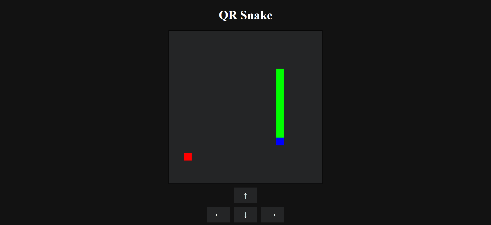

[![Contributors][contributors-shield]][contributors-url]
[![Forks][forks-shield]][forks-url]
[![Stargazers][stars-shield]][stars-url]
[![Issues][issues-shield]][issues-url]
[![MIT License][license-shield]][license-url]
[![LinkedIn][linkedin-shield]][linkedin-url]

<!-- PROJECT LOGO -->
 

  
<h3 align="center">QR-Snake</h3>
  

    A QR Code that contains snake!
  

<!-- ABOUT THE PROJECT -->
## About The Project

<!-- LICENSE -->
## License

Distributed under the MIT License. See `LICENSE.txt` for more information.

<!-- CONTACT -->
## Contact

Klinefelters - klinefelters@etown.edu

Project Link: [https://github.com/klinefelters/QR-Snake](https://github.com/klinefelters/QR-Snake)

[contributors-shield]: https://img.shields.io/github/contributors/klinefelters/QR-Snake.svg?style=for-the-badge
[contributors-url]: https://github.com/klinefelters/QR-Snake/graphs/contributors
[forks-shield]: https://img.shields.io/github/forks/klinefelters/QR-Snake.svg?style=for-the-badge
[forks-url]: https://github.com/klinefelters/QR-Snake/network/members
[stars-shield]: https://img.shields.io/github/stars/klinefelters/QR-Snake.svg?style=for-the-badge
[stars-url]: https://github.com/klinefelters/QR-Snake/stargazers
[issues-shield]: https://img.shields.io/github/issues/klinefelters/QR-Snake.svg?style=for-the-badge
[issues-url]: https://github.com/klinefelters/QR-Snake/issues
[license-shield]: https://img.shields.io/github/license/klinefelters/QR-Snake.svg?style=for-the-badge
[license-url]: https://github.com/klinefelters/QR-Snake/blob/master/LICENSE.txt
[linkedin-shield]: https://img.shields.io/badge/-LinkedIn-black.svg?style=for-the-badge&logo=linkedin&colorB=555
[linkedin-url]: https://linkedin.com/in/klinefelters
[product-screenshot]: images/screenshot.png